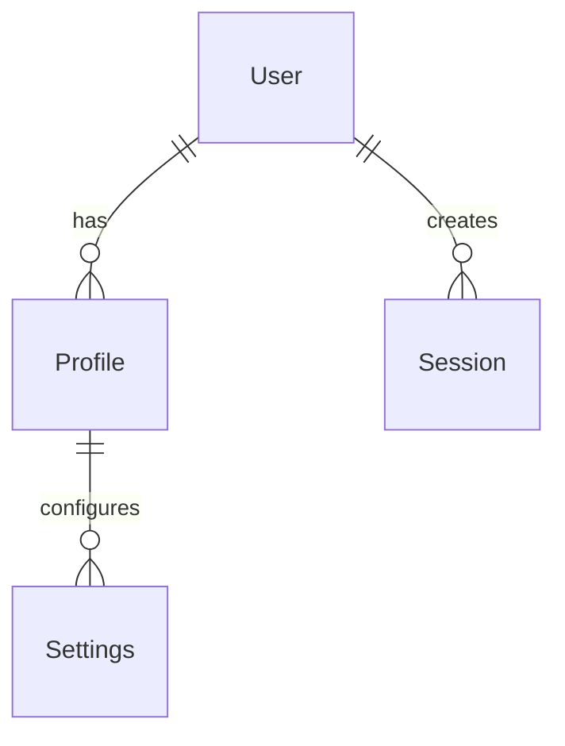
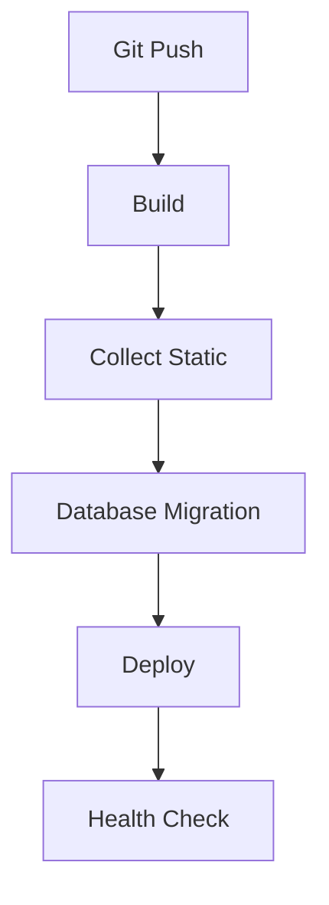

# 🏗️ Arquitetura do Sistema

Este documento detalha a arquitetura do sistema HOZ TECH.

## 📋 Visão Geral

O HOZ TECH é uma aplicação web Django moderna com design cyberpunk, focada em alta performance e segurança.

### Stack Principal

- **Backend**: Django 5.2.1
- **Frontend**: Bootstrap 5.3.2 + Custom CSS
- **Database**: PostgreSQL/SQLite
- **Cache**: Redis (opcional)
- **Deploy**: Render.com

## 🎨 Frontend

### Componentes

1. **Navbar**
   - Design cyberpunk responsivo
   - Animações suaves
   - Menu mobile otimizado
   - Integração com Bootstrap

2. **Templates**
   - Estrutura hierárquica
   - Herança de templates
   - Blocos reutilizáveis
   - Otimização de performance

3. **Estilos**
   - CSS customizado
   - Variáveis CSS
   - Design system próprio
   - Compatibilidade cross-browser

### Assets

```
core/static/
├── css/
│   ├── core_base.css      # Estilos base
│   ├── core_images.css    # Estilos de imagens
│   └── core_output.css    # Estilos de output
├── js/
│   ├── core_navbar.js     # Lógica da navbar
│   └── core_utils.js      # Utilitários JS
└── images/
    └── logo.png          # Logo e assets
```

## 🔧 Backend

### Estrutura Django

```
core/
├── management/           # Comandos custom
├── migrations/          # Migrações do banco
├── templates/           # Templates HTML
├── templatetags/        # Tags customizadas
├── tests/              # Testes unitários
├── views/              # Views da aplicação
├── models.py           # Modelos de dados
├── urls.py            # Configuração de URLs
└── apps.py           # Configuração da app
```

### Apps Django

1. **Core**
   - Funcionalidades principais
   - Gerenciamento de usuários
   - Dashboard admin

2. **API (futura)**
   - REST endpoints
   - Autenticação JWT
   - Documentação OpenAPI

## 💾 Banco de Dados

### Modelo de Dados



### Índices

- Otimização de queries
- Índices compostos
- Índices parciais
- Análise de performance

## 🔐 Segurança

### Camadas

1. **Aplicação**
   - CSRF protection
   - XSS prevention
   - SQL injection protection
   - Secure headers

2. **Infraestrutura**
   - SSL/TLS
   - WAF
   - Rate limiting
   - DDoS protection

3. **Dados**
   - Encryption at rest
   - Secure backups
   - Access control
   - Audit logging

## 🚀 Deploy

### Ambiente Render



### Configurações

1. **Web Service**
   - Python runtime
   - Environment variables
   - Build commands
   - Health checks

2. **Database**
   - PostgreSQL
   - Backups
   - Monitoring
   - Scaling

## 📊 Monitoramento

### Métricas

1. **Performance**
   - Response time
   - Database queries
   - Cache hit rate
   - Resource usage

2. **Negócio**
   - User activity
   - Error rates
   - Conversion rates
   - Usage patterns

## 🔄 Cache

### Estratégias

1. **Template Cache**
   - Fragment caching
   - Per-view caching
   - Template inheritance

2. **Data Cache**
   - Query cache
   - Object cache
   - Session cache

3. **Static Files**
   - WhiteNoise
   - Browser caching
   - Cache busting

## 📱 Responsividade

### Breakpoints

```css
/* Mobile First */
@media (min-width: 576px) { /* Small */ }
@media (min-width: 768px) { /* Medium */ }
@media (min-width: 992px) { /* Large */ }
@media (min-width: 1200px) { /* Extra Large */ }
```

### Estratégias

1. **Layout**
   - Flexbox/Grid
   - Mobile-first
   - Fluid typography
   - Adaptive images

2. **Performance**
   - Lazy loading
   - Image optimization
   - Critical CSS
   - Progressive enhancement

## 🔍 SEO

### Otimizações

1. **Técnicas**
   - Meta tags
   - Semantic HTML
   - Structured data
   - Sitemap XML

2. **Performance**
   - Core Web Vitals
   - Mobile-friendly
   - HTTPS
   - Accessibility

## 📈 Escalabilidade

### Horizontal

- Load balancing
- Stateless design
- Distributed caching
- Database sharding

### Vertical

- Resource optimization
- Query optimization
- Caching strategies
- Asset optimization

## 🔌 Integrações

### Atuais

- Render.com (Deploy)
- Bootstrap (UI)
- WhiteNoise (Static Files)

### Futuras

- Redis (Cache)
- Sentry (Error Tracking)
- New Relic (APM)
- CloudFlare (CDN)

## 📚 Referências

- [Django Documentation](https://docs.djangoproject.com/)
- [Bootstrap Documentation](https://getbootstrap.com/docs/)
- [Render Documentation](https://render.com/docs)
- [WhiteNoise Documentation](http://whitenoise.evans.io/) 